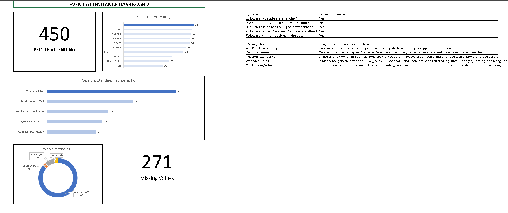

# 📋 Event Attendees Dashboard — Excel Project

> **Tool:** Microsoft Excel | **Goal:** Clean, analyze, and visualize event attendee data into an actionable dashboard.

---

## 🗂️ Workflow Overview

```
Raw Data (Original Sheet)
    ↓
EDA_Table        ← Exploratory Data Analysis & Duplicate Detection
    ↓
Clean_Table      ← Cleaned & Standardized Data
    ↓
Pivot Tables     ← Aggregated Views
    ↓
Dashboard        ← Answering EDA Questions Visually
```

---

## 🔍 Phase 1 — Exploratory Data Analysis (EDA)

### Step 1 — Copy the Raw Data

| Action | Tool | Result | Reflection |
|---|---|---|---|
| Create copy of data | Right-click sheet → Move or Copy → Create a copy | New sheet with copy of original data | Original sheet stays untouched for reference |

---

### Step 2 — Create `TempID` Column

```excel
=[@Name]&[@Email]&[@Country]&[@Session]&[@[Arrival Time]]&[@Seat]&[@[Food Preference]]&[@Role]
```

> Concatenates all key fields into a unique identifier per record, allowing precise duplicate detection across all attributes.

---

### Step 3 — Highlight Duplicates with Conditional Formatting

```
Home → Conditional Formatting → Highlight Cell Rules → Duplicate Values
```

> Duplicate `TempID` values are colored **light red**, making them immediately visible in `EDA_Table`.

---

### Step 4 — Create `Duplicate Check` Column

```excel
=IF(COUNTIF([Temp ID],[@[Temp ID]])>1,"Duplicate","Unique")
```

> Labels each row explicitly as `Duplicate` or `Unique` for easy filtering and counting.

---

### Step 5 — Data Quality Summary

A summary table is created to get a snapshot of overall data health:

| Metric | Description |
|---|---|
| Total Records | Count of all rows in the table |
| Total Blanks | Count of rows with at least one missing field |
| Total Duplicates Found | Count of rows flagged as `Duplicate` |
| Total Unique Found | Count of rows flagged as `Unique` |

---

### Step 6 — Pivot Table for EDA

```
Select table → Insert → Pivot Table
```

Three pivot views are created to understand the data:

- 👥 **Attendees by Role** — Who is attending and in what capacity
- 🌍 **Attendees by Country** — Where guests are travelling from
- 📅 **Session Registration** — Which sessions attendees have registered for

---

### Step 7 — EDA Questions

Based on the pivot table insights, the following 5 questions are defined to guide the dashboard:

| # | Question |
|---|---|
| 1 | How many people are attending? |
| 2 | What countries are guests travelling from? |
| 3 | Which session has the highest attendance? |
| 4 | How many VIPs, Speakers, and Sponsors are attending? |
| 5 | How many missing values are in the data? |

---

## 🧹 Phase 2 — Data Cleaning (`Clean_Table`)

### Step 8 — Flag Missing Values

```excel
=IF(OR([@Name]="",[@Email]="",[@Country]="",[@Session]="",[@[Arrival Time]]="",[@Seat]="",[@[Food Preference]]="",[@Role]=""),"Missing","OK")
```

> Checks all key fields in a single formula. Rows with any blank field are flagged as `Missing`; complete rows are marked `OK`.

---

### Step 9 — Standardize Arrival Time Format

```excel
=TEXT(E2:E551,"hh:mm AM/PM")
```

> Converts inconsistent time formats to a uniform `hh:mm AM/PM` text format across all records.

---

### Step 10 — Create `TempID` in `Clean_Table`

```excel
=[@Name]&[@Email]&[@Country]&[@Session]&[@[Arrival Time]]&[@Seat]&[@[Food Preference]]&[@Role]
```

> Same unique identifier logic applied to the cleaned dataset.

---

### Step 11 — Create `Duplicate Check` in `Clean_Table`

```excel
=IF(COUNTIF([Temp ID],[@[Temp ID]])>1,"Duplicate","Unique")
```

---

### Step 12 — Remove Duplicates

```
Data → Remove Duplicates → Unselect All → Select [TempID] column → OK
```

> Removes rows with duplicate `TempID` values, eliminating records caused by human error while preserving all genuinely unique attendees.

---

### Step 13 — Create Role Flag Columns

Four binary columns are added to segment attendees by role for easy counting and filtering:

| Column | Formula |
|---|---|
| `IsVIP` | `=IF([@Role]="VIP",1,0)` |
| `IsSpeaker` | `=IF([@Role]="Speaker",1,0)` |
| `IsSponsor` | `=IF([@Role]="Sponsor",1,0)` |
| `IsNormalAttendee` | `=IF([@Role]="Attendee",1,0)` |

> Binary flags (1/0) make it easy to `SUM` each role count directly in the dashboard.

---

## 📊 Phase 3 — Dashboard



Each EDA question is answered with a dedicated metric or chart:

| # | Question | Answer Method |
|---|---|---|
| 1 | How many people are attending? | `=COUNTA(Clean_Table[Name])` → Scorecard |
| 2 | What countries are guests travelling from? | Horizontal Bar Chart (smallest → largest) |
| 3 | Which session has the highest attendance? | Horizontal Bar Chart (smallest → largest) |
| 4 | How many VIPs, Speakers, Sponsors are attending? | Doughnut Chart |
| 5 | How many missing values in the data? | `=COUNTA('Clean_Table'!P2:P451)` → Scorecard |

### Chart Build Steps

**Bar Charts (Q2 & Q3)**
```
Insert → Recommended Chart → Bar Chart
→ Sort smallest to largest
→ PivotChart Analyze → Field Buttons → Hide All
→ Clean up: remove axes clutter, add data labels, set chart title
```

**Doughnut Chart (Q4)**
```
Insert → Recommended Chart → Doughnut Chart
→ PivotChart Analyze → Field Buttons → Hide All
→ Right-click chart → Add Data Labels → Add Data Callouts
→ Clean up: chart title and label formatting
```

---

## ✅ Dashboard Questions — Answered

| Question | Answered |
|---|---|
| How many people are attending? | ✅ Yes |
| What countries are guests travelling from? | ✅ Yes |
| Which session has the highest attendance? | ✅ Yes |
| How many VIPs, Speakers, Sponsors are attending? | ✅ Yes |
| How many missing values in the data? | ✅ Yes |

---

## 💡 Insights & Action Recommendations

| Metric / Chart | Insight | Recommended Action |
|---|---|---|
| **450 People Attending** | Full attendance confirmed | Confirm venue capacity, catering volume, and registration staffing |
| **Countries Attending** | Top countries: India, Japan, Australia | Customize welcome materials and signage for top-represented countries |
| **Session Attendance** | *AI Ethics* and *Women in Tech* are most popular | Allocate larger rooms and prioritize tech support for these sessions |
| **Attendee Roles** | 86% are general attendees; VIPs, Sponsors & Speakers are minority | Prepare tailored logistics — badges, seating, and recognition for special roles |
| **271 Missing Values** | Data gaps may affect personalization and reporting | Send a follow-up form or reminder to complete missing attendee fields |

---

## 📁 Sheet Structure

```
📊 Attendees              ← Original raw data (untouched)
📊 EDA_Table              ← Duplicate detection & data quality checks
📊 Clean_Table            ← Cleaned, standardized, deduplicated data
📊 Pivot_Tables           ← Aggregated views feeding the dashboard
📊 Dashboard              ← Final visual dashboard answering EDA questions
```
